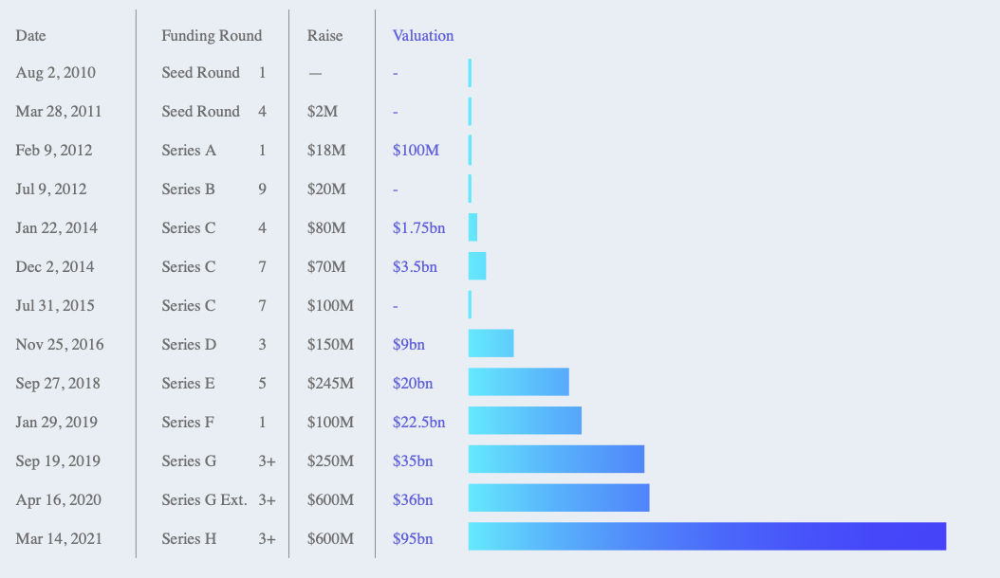
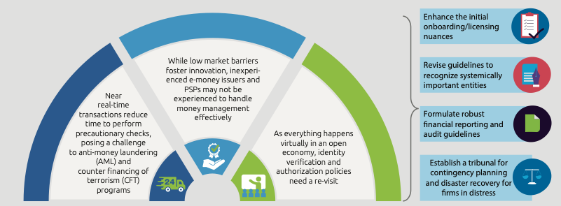
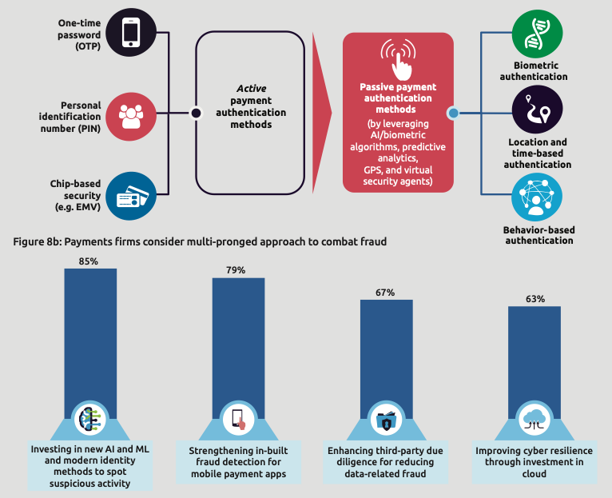
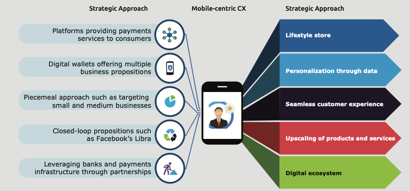
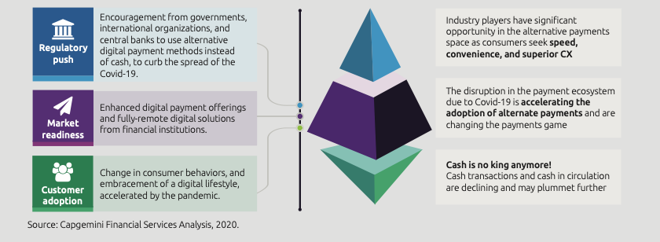
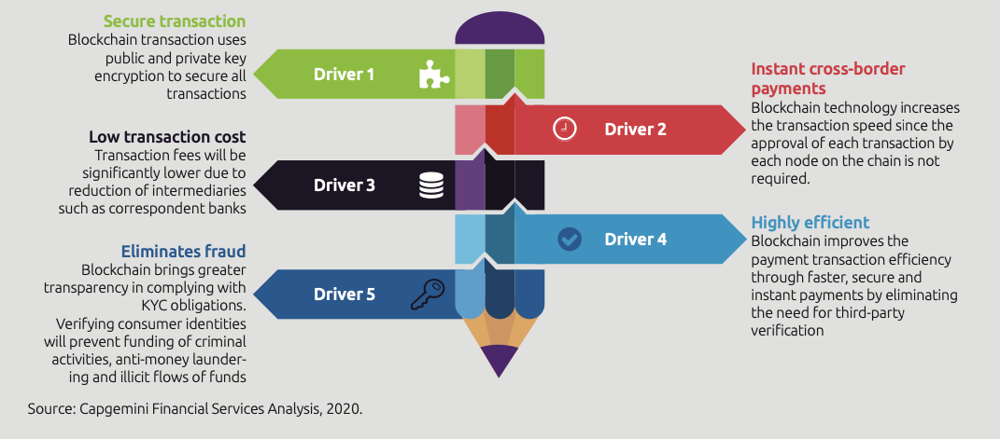
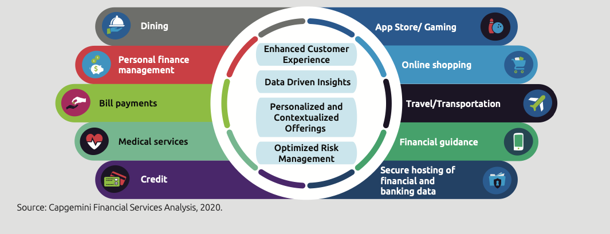
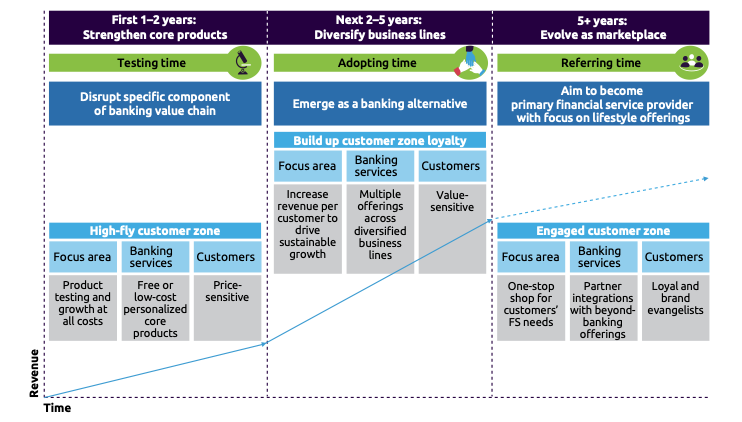

# Fintech Case Study: Stripe 

-----------------------------

## **Overview and Origin**
[Stripe](https://www.stripe.com) company was founded in 2009 in Palo Alto CA by the two brothers John, and Patrick collison.(Stripe, 2021)

The idea was forming in thier heads when John was 15 and Patrick was 17 years old, they launched thier first startup company tha t was called Auctomatice that aimed to track eBay inventory and traffic for thier clients. This service software company were sold for $5m to a canadian company.

After selling thier company the two brothers were thinking about a problem that people struggled to solve at that time, it was easy to sell stuff online using one of e-commerce platforms, but what was difficult and expnsive is securly take cusomter's money.

The process of a transcation, it was involving every merchant account with multiple credit card companies with frustrating delays and high fees. This is where the idea stated by realising that the online payment industry was missing a platform that can solve such big problem.

Stripe was designed to make it easy to setup and an account and process payments online through thier platform, it made it simple for any website or app to accept payments without having lenghy processes obtainings licneces, in return Stripe charges fix 2.9% fee. (The Guardian, 2021) 

Stripe's first funding came from YCombinator, the startup didnt go through standard startup bootcamp like other startups. The two brothers were able to secure thier first amount between $20-$30k range. The next summer they met Peter Thiel and he offered to invest in thier company, they raised $2m to thier portfolio. (Startup Grind, 2020)

Stripe has a post-money valuation in the range of $10B+ as of Mar 2021, according to PrivCo. The company is funded by 41 investors as shown in the chart below.

--------------

## **Business Activities**
### What specific financial problem is the company or project trying to solve?

Stripe focused on organising the right functionality that can offer  through thier powerful platform to thier clients saving them months of integration of payments capabilities. Which allows thier client to focus and have more time on building thier core product and customer experience rather than wasting times in integration of online payments systems. (Stripe, 2021)

The platform also focusing on solving the following problems:

- Accept payments
- Manage billing & subscriptions
- Offer flexible payouts
- Optimise checkout
- Reduce fraud
- Scale global payments
- Increase conversion
- Embed financial services (Stripe, 2021)

### **Who is the company's intended customer?** 

The company has built a paltofrm for all ambitious companies around the world to make money move as simple, borderless and programmatic as the rest of the internet. Stripe's team is based in dozens of global offices and they have facilitated processing billions of dollars each year for every size of business, From a startup to Fortune500 compaines.

### **Is there any information about the market size of this set of customers?**

The online retail sales surged to $794.50 Billion, a record-breaking 14.4% of total US retail in 2020. Payments made via credit card will grow from $1.75 trillion in 2019 to $1.82 trillion in 2024. Mobile proximity payment volume accelerated to $131.36 billion, per Insider Intelligence estimates, as major wallets added users at a record clip in 2020. (Business Insider, 2021)

#### **What solution does this company offer that their competitors do not or cannot offer? (What is the unfair advantage they utilize?)**

The following are some of the most notable advantages of using Stripe:

- Pricing: Stripe has a simple, transparent pricing structure and only charges transaction fees, the company does not charge other typical fees that you would see from other providers.
- Functionality: Stripe is extremely functional, allowing you to accept all types of payments in the way that works best for your business, which give them more advantages over the other platforms.

- Customization: Stripe is often referred to as a “developer’s payments solution,” due to their custom UI toolkit and available APIs. Even if you’re not a developer, Stripe offers an impressive level of customization for all business owners. (Fundera, 2020)

Stripe was able to connect to all platforms and integrate with many service providers which took the company to be leading in the market in 10 years since it started, accelerating the advancment of thier technologies made the company partner with companies like Classy, lyft, substack, and many others big compaines. 

## **Technologies** 

The company was able to be leading in the following technologies : 

- Payments APIs.
- Developing an interactive glove.
- Remote engineering hub.
- Similarity clustering to catch fraud rings.
- Stripe CLI ( command-line interface (CLI). It lets you interact with Stripe right from the terminal and makes it easier to build).
- Fast and flexible observability with canonical log lines.
- The secret life of DNS packets: investigating complex networks.
- The secret life of DNS packets: investigating complex networks.
- Supporting Hypothesis
- Supporting for .NET

----------------

## **Landscape**

The company is in the developer-focused payments API industry as per Forbes (Forbes, 2021), The following charts explains the trends and drivers that has changed this domain in the past 10 years: 

(Fintech World Report,A, 2021)

### ***Stripe's Top Competitors***

1.	Square  
2.	PayPal 
3.	Adyen  
4.	2Checkout  
5.	WePay  
6.	Authorize.Net 
7.	Braintree  
8.	Payline Data  
9.	PayJunction  
10.	Fattmerchant  (Fundera, 2020)
-----------------
## **Results**

In a year that demanded digitalization, regulators and payment firms diligently prioritized technology transformation for getting closer to their customers. Digital embracement to provide customer- centricity was at the top of most payments executives’ agendas and will remain a 2021 focal point. Banks are actively adopting a curate-and-collaborate approach to develop in-house capabilities by collaborating with agile players. COVID-19 was a catalyst to prioritize risk management as it triggered security awareness and safety efforts. A unified industry framework to combat fraud becomes the priority, especially in open networks.

Non-cash transaction continues its strong and steady forward march, as digital payments adoption among customers heightens. Growth is being driven by rapidly increasing smartphone penetration, a booming e-commerce segment, flourishing adoption of digital wallets, and innovations – primarily mobile–and QR-code payments.

For an industry that was already transitioning among several disruptive factors, COVID-19 accelerated the urgency for rapid change. Industry volatility, sluggish economic activity, and the ongoing crisis have debilitated the dynamics significantly.

Stripe has changed the game of the Payment Industry with its innovations. Which made it the leading in the market, the company now its working on expanding its loyality base to be taking the banks position as shown in the chart below.

(Fintech World Report,B, 2021)

--------

## **Recommendations**

It Is highly recommended for Stripe to open thier platform for outsourcing to let the public participate in the innovation of the Payments industry soloutions to let more people be part of this journey and to be able to adabt more ideas from multiple places in the world as the payment processing is different from country to country.

This will allow the comapny to expand its base to more countries and to parts of the world that it didnt reach yet, more in the poor side of the world. 

Allowing this it will connect the world more together to bring easier payment soloutions to the whole globe.

-----------------------------

https://wws.stripe.com (Stripe, 2021)

https://www.theguardian.com/commentisfree/2021/mar/20/how-two-irish-brothers-started-a-70bn-company-stripe-john-patrick-collison (The Guardian, 2021)

https://www.startupgrind.com/blog/the-collison-brothers-and-story-behind-the-founding-of-stripe/(Startup grind, 2020)

https://www.businessinsider.com/payments-ecosystem-report?r=AU&IR=T (Business Insider, 2021)

https://www.fundera.com/blog/stripe-competitors (Fundera, 2020)

https://fintechworldreport.com/wp-content/uploads/sites/9/2021/05/World-FinTech-Report-2021.pdf (Fintech World Report,B, 2021)

https://www.capgemini.com/resources/top-trends-in-payments-2021/ (Fintech World Report,A, 2021)